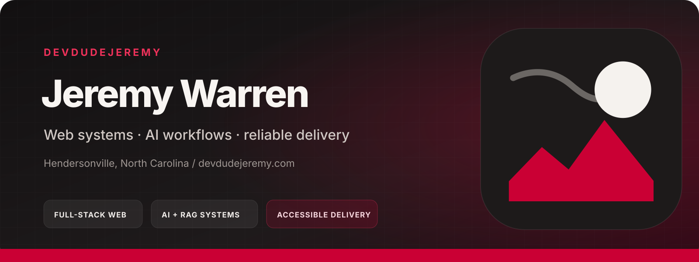

## Useful software, built to last.

DevDudeJeremy is Jeremy Warren's independent product engineering practice. I build accessible web applications, grounded AI systems, and durable delivery workflows for organizations that need the work to keep making sense after launch.

[**Start a project →**](https://devdudejeremy.com/hire/)

[See the case studies](https://devdudejeremy.com/projects/) · [Review open-source work](https://github.com/orgs/DevDudeJeremy/repositories)

  <strong>Product systems</strong> · <strong>Grounded AI</strong> · <strong>Accessible delivery</strong>

## Selected systems

### 01 / PropsMath

**Live product · Sports analytics**

A sports analytics platform whose forecast model publishes timestamped win probabilities for MMA and college football before each event, then grades every one in public, misses included.

[Visit PropsMath](https://propsmath.com/) · [Read how a PropsMath forecast is built](https://propsmath.com/methodology) · [Open the PropsMath public record](https://propsmath.com/track-record)

### 02 / Neighborhood Tools

**Live product case study · Web application**

A peer-to-peer tool-sharing experience that turns borrowing, handoff, deposits, and trust into one coherent workflow.

[Visit Neighborhood Tools](https://neighborhoodtools.org/) · [Read the Neighborhood Tools case study](https://devdudejeremy.com/projects/neighborhood-tools/) · [Review the Neighborhood Tools project notes](https://github.com/DevDudeJeremy/neighborhood-tools)

### 03 / The Warren

**Open source · v1.0 · Developer tooling**

A workflow toolkit for Claude Code that packages reusable skills, chained commands, and model-routed agents into an inspectable system.

[Explore The Warren source](https://github.com/DevDudeJeremy/warren) · [Review The Warren v1.0 release](https://github.com/DevDudeJeremy/warren/releases/tag/v1.0.0)

### 04 / Docs RAG

**Live embedded case study · Grounded AI**

A citation-grounded assistant using hybrid retrieval to help visitors explore the projects and documentation behind devdudejeremy.com.

[Read the Docs RAG case study](https://devdudejeremy.com/projects/rag-agent/) · [Review the Docs RAG project notes](https://github.com/DevDudeJeremy/docs-rag)

More in the workshop: [Shop Fusion](https://github.com/DevDudeJeremy/ecommerce-platform), [Inkstack](https://github.com/DevDudeJeremy/blog), and [the complete public repository catalog](https://github.com/orgs/DevDudeJeremy/repositories).

## Client sites

- **WNC Barber** — the website for two family-owned barber shops in Hendersonville and Asheville, with a page per shop and online booking. [Visit WNC Barber](https://www.wncbarber.com/)
- **Mills River PTO** — a donated, bilingual school community site with an admin area the volunteer board runs without code. [Visit Mills River PTO](https://millsriverschoolpto.com/) · [Read the Mills River PTO case study](https://devdudejeremy.com/projects/mills-river-pto/)
- **Mt. Zion Clinic** — a fast, accessible site for a nonprofit health center with three locations. [Visit Mt. Zion Clinic](https://mtzionclinic.org/) · [Read the Mt. Zion Clinic case study](https://devdudejeremy.com/projects/mt-zion-clinic/)

## What I build

- **Product systems** — accessible interfaces, maintainable back ends, integrations, payments, and data models designed as one coherent product.
- **Grounded AI** — retrieval pipelines and assistants anchored in the documents, policies, and knowledge that matter to the organization using them.
- **Stewardship and modernization** — focused improvements to performance, reliability, security posture, dependencies, and long-lived application code.

Across all three, accessible delivery, secure defaults, clear evidence, and a durable handoff are part of the work—not optional polish.

## How the work holds up

- **Start with the real constraint.** Technology choices should serve the people, operations, and risks already present.
- **Verify the behavior that matters.** Tests and review should follow the paths users and operators actually depend on.
- **Leave ownership behind.** Documentation, automation, and understandable code are part of the finished product.

<strong>Current toolkit</strong>

- **Applications:** TypeScript, JavaScript, PHP, Python, React, Next.js, Astro, Django, PostgreSQL, MySQL, REST APIs
- **AI systems:** Claude API, MCP, hybrid retrieval, knowledge pipelines, AI assistants, and governed AI-assisted development workflows
- **Delivery:** GitHub Actions, Cloudflare, Vercel, SiteGround, testing, observability, performance, and ongoing maintenance
- **Certification:** [Claude Certified Developer – Foundations (Anthropic)](https://www.credly.com/badges/ef5e9547-7ff1-4ab8-beda-f974ba84fb36/public_url)

## Have something useful to build?

Tell me what needs to work, who it needs to work for, and what cannot fail. I will help turn that into a practical next step.

[**Start a conversation →**](https://devdudejeremy.com/contact/)

Based in Hendersonville, North Carolina · Available for select client work and full-time opportunities
